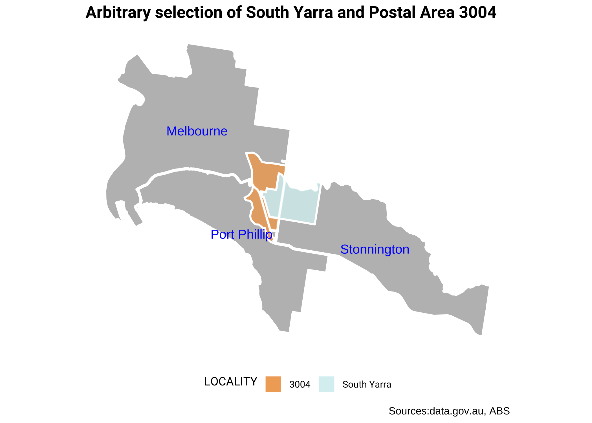
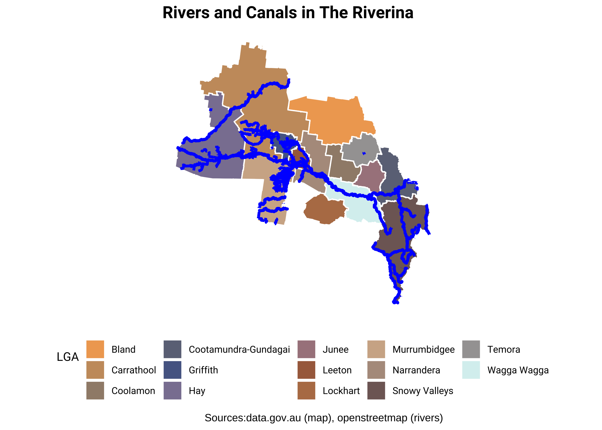
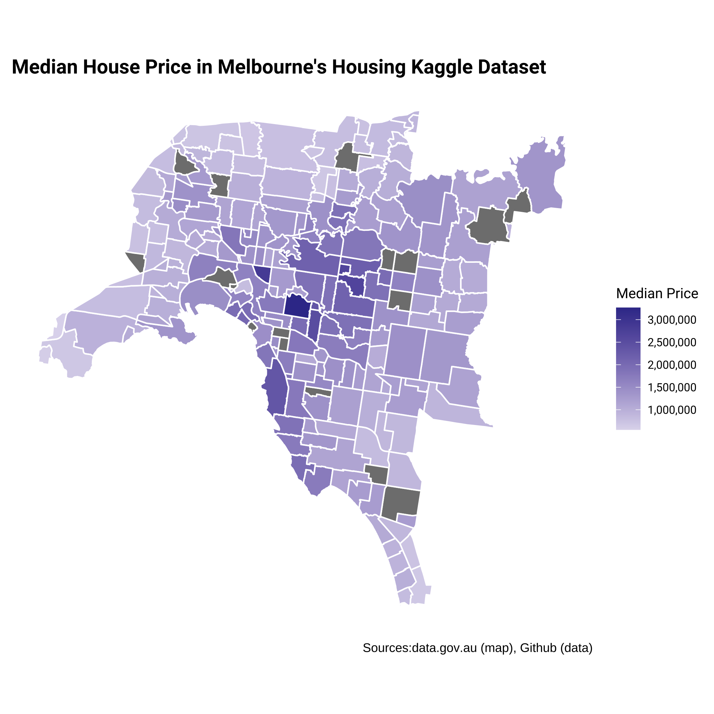

aussiemaps
================

**aussiemaps** provides Australian LGA, suburbs and Postal Area maps
directly in R, without any need to download and process shapefiles.

The data for the package has been created using the scripts provided
[here](https://github.com/carlosyanez/Australian_Polygons). The sf
objects in this contain (Suburb,LGA, Postal Area) intersection polygons,
which allow to select, filter and re-construct any of those geographic
units.

## Installation and pre-requisites

First install required packages

`install.packages("tidyverse","sf","lwgeom","devtools")`

then, install this package from github

`devtools::install_github("carlosyanez/aussiemaps")`

## How to use

The main function in this package is **load\_map()**, which retrieves a
selected portion of the map based on a filter “tibble” and an
aggregation attribute.

Filter tibbles can be created any combination of attributes available on
**list\_aggregations**, as long as *State* is present. Another way to
create a filter tibble is to subset **locations.table**, which is
included in package.

Aggregations are optional, if not added, will retrieve the granular
polygons directly.

The below plot shows and example on how to retrieve different sf
objects, with different aggregations (postal area 3004 covers parts of
two different suburs. South Yarra is shared across two LGAs).

``` r
melb_inner1_filter<- tibble(LGA=c("Melbourne","Port Phillip","Stonnington"),State=rep("VIC",3)) 

melb_inner1 <-  load_map(melb_inner1_filter,aggregation = "LGA") 

melb_inner1.centroid <- st_centroid(melb_inner1)

#works wiht pipes too
melb_inner2 <- tibble(LOCALITY=c("South Yarra"),State=c("VIC")) %>% 
                     load_map()

melb_inner3 <- tibble(POA_CODE16=c("3004"),State=c("VIC")) %>% 
                     load_map()

p <- ggplot() + 
  geom_sf(data=melb_inner1,colour="white",size=1.2,fill="grey") +
  geom_sf(data=melb_inner2,aes(fill=LOCALITY),alpha=0.8,colour="white",size=0.8) +
  geom_sf(data=melb_inner3,aes(fill=POA_CODE16),alpha=0.8,colour="white",size=0.8) +
  geom_sf_text(data = melb_inner1.centroid, aes(label = LGA), colour = "blue") +
  scale_fill_ochre("lorikeet") +
  custom_map_theme() +
  labs(title="Arbitrary selection of South Yarra and Postal Area 3004", 
       caption="Sources:data.gov.au, ABS")
```



The package also contains a number of pre-defined “regions”. These are
either official (e.g. Grampians Region) or *unofficial* (e.g. Limestone
coast) divisions. These regions can also cross state lines (e.g. Gold
Coast - Tweed Heads). To find out the existing regions, run
*list\_regions()*. With the region name, *get\_region()* will produce
the corresponding filter tibble.

``` r
#get regions
riverina <- get_region("The Riverina") %>% load_map(aggregation=c("LGA","State","Region"))

#draw contour for filtering
riverina_contour <- riverina %>% 
                     group_by(Region) %>% summarise(.groups = "drop") %>%
                     clean_polygons()

#get rivers from OSM

riverina_bbox <- st_bbox(riverina)

rivers <- opq(riverina_bbox) %>%
        add_osm_feature(key = "waterway",
                  value = c("river","canal","creeks")) %>%
        osmdata_sf()

rivers <- rbind(rivers$osm_lines %>% select(osm_id,name),
                rivers$osm_multilines%>% select(osm_id,name)) %>%
          st_transform(st_crs(riverina_contour)) %>%
          st_intersection(riverina_contour)

#plot

p<- ggplot() + 
  geom_sf(data=riverina, aes(fill=LGA), colour="white", size=0.5) +
  geom_sf(data=rivers,colour="blue",size=1.1)+
  custom_map_theme()+
  scale_fill_ochre()  + 
  labs(title="Rivers and Canals in The Riverina", 
       caption="Sources:data.gov.au (map), openstreetmap (rivers)")
```



Since the loaded objects are sf objects, they can be easily merge with
data frames or tibbles to add additional data for visualisation.

``` r
# load dataset from github
url <- "https://github.com/dipalira/Melbourne-Housing-Data-Kaggle/raw/master/Data/Melbourne_housing_FULL.csv"
melb_housing <- read_csv(url)

# get median price by suburb
melb_price <- melb_housing %>% filter(Type=="h") %>%
              group_by(Suburb) %>% 
              summarise(medianprice=median(Price,na.rm=TRUE),.groups="drop")

#join get sf object and add median prices
Melbourne <- get_region("Greater Metropolitan Melbourne") %>% 
             load_map(aggregation=c("LOCALITY","Metro.Region")) %>%
             left_join(melb_price,by=c("LOCALITY"="Suburb")) %>%
             filter(Metro.Region %in% c("Inner Melbourne","Metropolitan Melbourne"))

#plot
p<- Melbourne %>% ggplot() + 
  geom_sf(aes(fill=medianprice), colour="white", size=0.5) +
   custom_map_theme()+
    theme(legend.position = "right",
          legend.direction = "vertical") + 
    scale_fill_gradient2(name="Median Price",
                         labels=function(x) format(x, big.mark = ",", scientific = FALSE)) +
    labs(title="Median House Price in Melbourne's Housing Kaggle Dataset", 
         caption="Sources:data.gov.au (map), Github (data)") 
```



## Not for you?

The development of this package is still in progress.It also intends to
provide granular suburb/postal area maps, so it may not be suitable for
some use cases. There are other great Australian maps packages, such as:

-   [ozmaps](https://mdsumner.github.io/ozmaps/), which has good
    nation-wide, states and LGA maps, as well as electoral divisions.
    This package is on CRAN.
-   [absmaps](https://github.com/wfmackey/absmaps), which provides maps
    for all ABS statistical divisions.

## Issues? bugs? Ideas?

If you find something that is not quite right, please post an issue. If
you have any ideas, or want to collaborate please let me know!

## To Do

At the moment, this package only provides maps for
[internal](https://en.wikipedia.org/wiki/States_and_territories_of_Australia)
states and territories.

## Credits

-   LGA and localities maps have been sourced from
    [data.gov.au](htttp:///data.gov.au) and used under CC0-BY licence.
-   Postal areas have constructed using definitions and shape files from
    the [Australian Bureau of Statistics (ABS)](https://www.abs.gov.au/)
